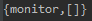
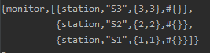
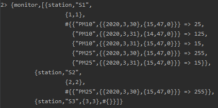
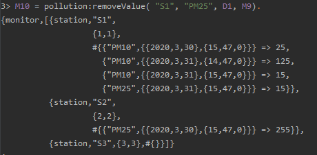
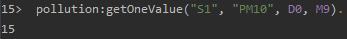
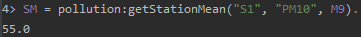
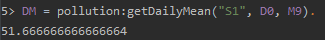
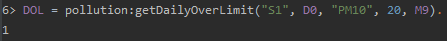
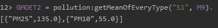

### Zaimplementuj samodzielnie funkcje wyższego rzędu `map/2` oraz `filter/2`.

```erlang
map(_, []) -> [];
map(Fun1, [H | T]) -> [Fun1(H) | map(Fun1, T)].

filter(Fun1, L) -> [H || H <- L, Fun1(H) == true].
```

### Stwórz funkcję, która policzy sumę cyfr w liczbie. Użyj do tego `lists:foldl/3`.
```erlang
mapNrToList(0) -> [];
mapNrToList(Nr) -> [Nr rem 10 | mapNrToList(Nr div 10)].

digitsSum(Nr) -> lists:foldl(fun(Sum, Dig) -> Sum + Dig end, 0, mapNrToList(Nr)).
```
### Przy pomocy funkcji `lists:filter/2` wybierz z listy miliona losowych liczb takie, w których suma cyfr jest podzielna przez 3.
```erlang
highOrdFun:filter(fun(X) -> X rem 3==0 end, highOrdFun:randomElems(1000000, 0, 1000000)).
```

# Test for functions for module pollution

```erlang
M0 = pollution:createMonitor().
```



## Dodawanie stacji

```erlang
M1 = pollution:addStation("S1", {1, 1}, M0),
M2 = pollution:addStation("S2", {2, 2}, M1),
M3 = pollution:addStation("S3", {3, 3}, M2).
```


### Pomocnicze daty

```erlang
D0 = {{2020,3,31},{15,47,00}},
D1 = {{2020,3,30},{15,47,00}},
D2 = {{2020,3,31},{14,47,00}}.
```

## Dodawanie pomiarów

```erlang
M4 = pollution:addValue("S1", "PM10", D0, 15, M3),
M5 = pollution:addValue("S1", "PM10", D1, 25, M4),
M6 = pollution:addValue("S1", "PM10", D2, 125, M5),
M7 = pollution:addValue("S1", "PM25", D0, 15, M6),
M8 = pollution:addValue("S1", "PM25", D1, 255, M7),
M9 = pollution:addValue("S2", "PM25", D1, 255, M8).
```


## Usuwanie pomiaru

```erlang
M10 = pollution:removeValue( "S1", "PM25", D1, M9).
```



Jak widać pomiar PM25 w dniu 3.30.2020 został usunięty

Dalej będę uzywać M9 bez usunietego pomiaru

## Pozyskanie wartosci w danym dniu o danym typie

```erlang
pollution:getOneValue("S1", "PM10", D0, M9).
```




## Srednia stacji

```erlang
SM = pollution:getStationMean("S1", "PM10", M9).
```
Oczekujemy, że otrzymamy (25+125+15)/3 czyli 55



## Srednia dnia
```erlang
DM = pollution:getDailyMean("S1", D0, M9).
```
Daty D0 oraz D2 są w tym samym dniu, oczekujemy (15+125+15)/3 = 51.666



## Liczba pomiarów ponad limitem w danym dniu

```erlang
DOL = pollution:getDailyOverLimit("S1", D0, "PM10", 20, M9).
```
Oczekujemy jeden wynik, który był równy 125



## Spis średnich poszczególnych typów w danej stacji

```erlang
GMOET = pollution:getMeanOfEveryType("S1", M9).
```
Oczekujemy 2 typy: PM25 oraz PM10 z wartosciami kolejno 135 oraz 55

