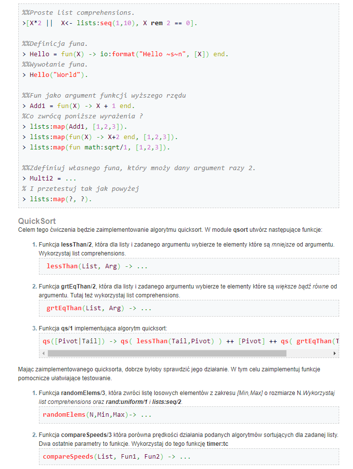
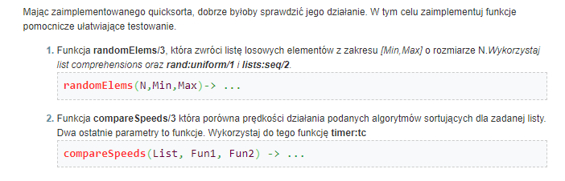
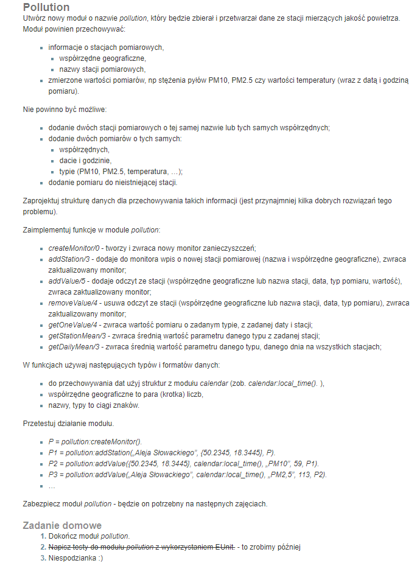

# Lab 2

## Polecenie




### Zaimplementuj samodzielnie funkcje wyższego rzędu `map/2` oraz `filter/2`.

```erlang
map(_, []) -> [];
map(Fun1, [H | T]) -> [Fun1(H) | map(Fun1, T)].

filter(Fun1, L) -> [H || H <- L, Fun1(H) == true].
```

### Stwórz funkcję, która policzy sumę cyfr w liczbie. Użyj do tego `lists:foldl/3`.
```erlang
mapNrToList(0) -> [];
mapNrToList(Nr) -> [Nr rem 10 | mapNrToList(Nr div 10)].

digitsSum(Nr) -> lists:foldl(fun(Sum, Dig) -> Sum + Dig end, 0, mapNrToList(Nr)).
```
### Przy pomocy funkcji `lists:filter/2` wybierz z listy miliona losowych liczb takie, w których suma cyfr jest podzielna przez 3.
```erlang
highOrdFun:filter(fun(X) -> X rem 3==0 end, highOrdFun:randomElems(1000000, 0, 1000000)).
```
